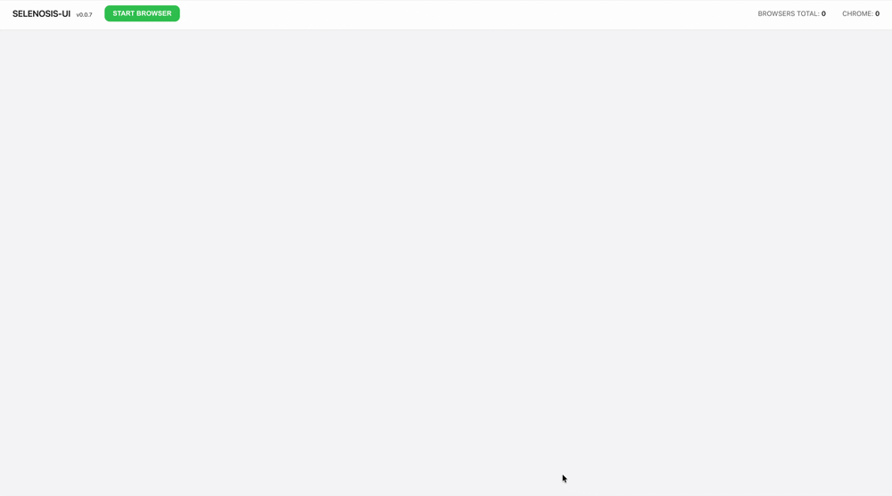

# selenosis

**Scalable, stateless Selenium / Playwright / MCP hub for Kubernetes.**
One ephemeral pod per session. No queue, no fixed grid, no leftover state. The hub
holds nothing — Kubernetes is the source of truth.

[](https://github.com/alcounit/selenosis/releases)
[](https://pkg.go.dev/github.com/alcounit/selenosis/v2)
[](https://hub.docker.com/r/alcounit/selenosis)
[](https://artifacthub.io/packages/search?repo=selenosis)
[](https://codecov.io/gh/alcounit/selenosis)
[](https://goreportcard.com/report/github.com/alcounit/selenosis/v2)
[](./LICENSE)

<p align="center">
  
</p>

---

## Why selenosis

Running browsers for automated testing or AI agents at scale usually means keeping a
long-lived, stateful browser fleet that you have to scale, drain, and babysit — and that
accumulates state and leaks resources over time. selenosis takes a different approach: it
is a **stateless hub** that turns every session into its own short-lived Kubernetes pod,
then tears it down the moment the session ends.

- **One session, one pod, zero shared state.** Each session runs in an isolated pod created on demand and deleted on exit — a crash or a leak never affects other sessions, and there is no grid to drain or restart.
- **The hub is stateless.** selenosis stores nothing locally; session-to-pod mapping is derived from the pod itself. You can run multiple replicas behind a load balancer and restart them freely.
- **Kubernetes-native, not Kubernetes-on-top.** Browsers are real `Browser` custom resources reconciled by an operator. You manage them with `kubectl`, RBAC, quotas, node selectors, and everything else you already use.
- **Selenium, Playwright, and MCP from one endpoint.** WebDriver (incl. BiDi), Chrome DevTools Protocol, Playwright over WebSocket, and the Model Context Protocol for AI agents — all proxied through the same hub.
- **Deterministic cleanup.** A dedicated controller guarantees that failed, evicted, idle, and orphaned pods are always removed, with a human-readable failure reason recorded before deletion.
- **Bring your own browser images.** Works with Selenoid, official Selenium standalone, Moon, and Microsoft Playwright images out of the box.

If you already run Kubernetes and have managed your own browser infrastructure before,
selenosis is meant to feel familiar while removing the stateful parts.

---

## How selenosis compares

| | **selenosis** | Selenium Grid 4 | Moon | Callisto |
| --- | --- | --- | --- | --- |
| Kubernetes-native | ✅ pods as CRDs | partial | ✅ | ✅ |
| Stateless / scalable hub | ✅ | ❌ | ✅ | ✅ |
| One pod per session | ✅ | ❌ (nodes) | ✅ | ✅ |
| Selenium / WebDriver | ✅ | ✅ | ✅ | ✅ |
| CDP | ✅ | ✅ | ✅ | ✅ (1.3.0+) |
| BiDi | ✅ | ✅ | ✅ | — |
| Playwright | ✅ | ❌ | ✅ | via CDP |
| MCP (AI agents) | ✅ experimental | ❌ | ❌ | ❌ |
| Custom sidecar HTTP routing | ✅ | ❌ | ❌ | ❌ |
| License | Apache-2.0 | Apache-2.0 | Commercial | MIT |

selenosis brings the Kubernetes-native, one-pod-per-session model together with
first-class Selenium, Playwright, and MCP support — all under a permissive open-source
(Apache-2.0) license.

---

## How it works

selenosis is the entry point of a small Kubernetes-native platform. You talk to the
hub with a standard Selenium, Playwright, or MCP client; everything behind it is
managed for you.

<p align="center">
  
</p>

1. A client opens a session against the hub (`POST /wd/hub/session`, `WS /playwright/...`, or `POST /mcp`).
2. selenosis creates a `Browser` custom resource through **browser-service**.
3. **browser-controller** reconciles that resource into exactly one pod, built from a reusable **BrowserConfig** template.
4. Once the pod is ready, selenosis proxies all session traffic to the **seleniferous** sidecar inside it.
5. When the session ends or times out, the sidecar and controller tear the pod down. Nothing is left behind.

---

## Ecosystem

selenosis is one component of a larger stack. For a normal deployment you install the
**Helm chart** and never touch the individual repos — but each is documented and
released independently.

| Component | Role |
| --- | --- |
| **[selenosis](https://github.com/alcounit/selenosis)** (this repo) | Stateless Selenium / Playwright / MCP hub. Requests browser sessions through browser-service and proxies session traffic. |
| **[seleniferous](https://github.com/alcounit/seleniferous)** | Sidecar proxy inside each browser pod. Manages session lifecycle, idle timeouts, and routing. |
| **[browser-controller](https://github.com/alcounit/browser-controller)** | Kubernetes operator that reconciles `Browser` and `BrowserConfig` CRDs into pods, with deterministic cleanup. |
| **[browser-service](https://github.com/alcounit/browser-service)** | REST + SSE facade over `Browser` and `BrowserConfig` resources. |
| **[browser-ui](https://github.com/alcounit/browser-ui)** | Web dashboard with a live session list and an in-browser VNC viewer. |
| **[selenosis-deploy](https://github.com/alcounit/selenosis-deploy)** | Helm chart that deploys the whole stack — CRDs, RBAC, all services, ingress. **Start here.** |

---

## Quick start

You need a Kubernetes cluster and Helm. The chart installs the CRDs, the controller,
all services, and the UI.

```bash
# 1. Add the Helm repository
helm repo add selenosis https://alcounit.github.io/selenosis-deploy/
helm repo update

# 2. Install the full stack
helm install selenosis selenosis/selenosis-deploy -n selenosis --create-namespace

# 3. Apply a ready-made BrowserConfig (defines which browser images to run)
kubectl apply -n selenosis \
  -f https://raw.githubusercontent.com/alcounit/selenosis-deploy/main/examples/browserconfig-selenium-standalone-chrome-example.yaml
```

Create your first session:

```bash
curl -sS -X POST http://<selenosis-host>:4444/wd/hub/session \
  -H 'Content-Type: application/json' \
  -d '{
    "capabilities": {
      "alwaysMatch": {
        "browserName": "chrome",
        "browserVersion": "120.0"
      }
    }
  }'
```

The response contains a `sessionId` you use for all subsequent commands. Watch the
pod come and go with `kubectl get brw -n selenosis`, or open **browser-ui** to see the
live session and connect to its VNC stream.

See the [chart's `values.yaml`](https://github.com/alcounit/selenosis-deploy) for image
versions, service types, ingress, session timeouts, and authentication.

---

## What you can run

selenosis works with the browser images you already know. The
[`examples/`](https://github.com/alcounit/selenosis-deploy/tree/main/examples) folder in
the chart has ready-to-apply `BrowserConfig` manifests for each:

- **Selenium standalone** (`selenium/standalone-*`) — official images with built-in VNC.
- **Selenoid-compatible images** (`twilio/selenoid`) — VNC built in, enabled via env var. The original Selenoid is discontinued; these come from community-maintained image tooling.
- **Moon images** (`quay.io/browser`) — including Playwright-specific CDP/BiDi variants.
- **Playwright** (`mcr.microsoft.com/playwright`) — multi-browser WebSocket server (Chromium, Firefox, WebKit).
- **Playwright MCP** (`mcr.microsoft.com/playwright/mcp`) — browser automation exposed over the Model Context Protocol.

---

## Protocols

A single hub speaks every protocol below; full request/response details live in the
sections further down and in the per-component READMEs.

- **WebDriver / Selenium** on `/` and `/wd/hub` — classic W3C session API.
- **WebDriver BiDi** — request `webSocketUrl: true` in capabilities; the response returns a BiDi WebSocket URL.
- **Chrome DevTools Protocol (CDP)** — transparently proxied for Chromium browsers.
- **Playwright** — `WS /playwright/{name}/{version}`, with dynamic pod configuration via query parameters.
- **MCP (experimental)** — Streamable HTTP transport on `/mcp` for Playwright and Selenium MCP servers, designed for AI agents that drive real browsers.

---

## Per-session configuration: `selenosis:options`

`selenosis:options` is a vendor-namespaced WebDriver capability that lets a client
override pod settings per session — labels and per-container environment variables —
without editing CRDs or cluster config. The controller applies them at pod creation
time.

```json
{
  "capabilities": {
    "alwaysMatch": {
      "browserName": "chrome",
      "browserVersion": "139.0",
      "selenosis:options": {
        "labels": { "team": "qa" },
        "containers": {
          "browser": { "env": { "LOG_LEVEL": "debug" } },
          "seleniferous": { "env": { "SESSION_IDLE_TIMEOUT": "3m" } }
        }
      }
    }
  }
}
```

For the Playwright and MCP endpoints, the same options are passed as query parameters
(for example `?labels.team=qa&containers.seleniferous.env.SESSION_IDLE_TIMEOUT=5m`).

Under the hood the resolved options are attached to the `Browser` resource as the
`selenosis.io/options` annotation and applied by the controller when the pod is created,
so you can inspect exactly what a session requested with `kubectl describe brw <id>`.

---

## Configuration

selenosis is configured via environment variables:

| Variable | Default | Description |
| --- | --- | --- |
| `LISTEN_ADDR` | `:4444` | HTTP listen address. |
| `BROWSER_SERVICE_URL` | `http://browser-service:8080` | `browser-service` API base URL. |
| `PROXY_PORT` | `4445` | Sidecar port inside the browser pod. |
| `NAMESPACE` | `selenosis` | Namespace where `Browser` resources are created. |
| `BROWSER_STARTUP_TIMEOUT` | `3m` | Maximum time for a `Browser` resource to become ready. |
| `BASIC_AUTH_FILE` | | Path to a JSON file with the list of Basic Auth users. |

Basic Authentication is optional and off by default; point `BASIC_AUTH_FILE` at a JSON
list of users (delivered via a Kubernetes Secret) to require credentials on every
request. The users file is watched and reloaded on change, so you can rotate
credentials without restarting the hub.

<details>
<summary><b>Session ownership and per-user labels</b></summary>

When Basic Authentication is enabled, selenosis records **who** started each session.
The authenticated username is stamped onto the `Browser` resource as the
`selenosis.io/owner` label (`SelenosisOwnerLabelKey` in the browser-controller API), and
the credentials are stripped from the proxied request before it leaves the hub.

Because ownership lives on the resource itself, you can use plain Kubernetes tooling to
attribute, filter, and operate on sessions per user — for example:

```bash
# All browser sessions started by a given user
kubectl get brw -n selenosis -l selenosis.io/owner=alice
```

The browser-controller also labels each `Browser` with the browser identity, so you can
slice sessions along several axes:

| Label | Meaning |
| --- | --- |
| `selenosis.io/owner` | Authenticated user who started the session (when Basic Auth is on). |
| `selenosis.io/browser` | Browser identifier. |
| `selenosis.io/browser.name` | Browser name (for example `chrome`). |
| `selenosis.io/browser.version` | Browser version. |

This makes per-user auditing, dashboards, and cleanup possible without any extra state
in the hub. It also pairs naturally with `ResourceQuota` if you want to cap how many
concurrent pods a tenant can hold.

</details>

---

## Endpoints

selenosis exposes Selenium-compatible endpoints on both `/` and `/wd/hub`.

| Method | Path | Description |
| --- | --- | --- |
| `POST` | `/session` or `/wd/hub/session` | Create a new WebDriver session. |
| `*` | `/session/{sessionId}/*` | Proxy all session traffic (HTTP and WebSocket). |
| `GET` | `/status` or `/wd/hub/status` | Service status. |
| `WS` | `/playwright/{name}/{version}` | Create and proxy a Playwright session. |
| `POST` | `/mcp` | MCP Streamable HTTP — initialize (with `?browser=&version=`) or route by `Mcp-Session-Id`. |
| `GET` | `/mcp` | MCP Streamable HTTP — server-initiated stream. |
| `DELETE` | `/mcp` | Terminate an MCP session and tear down its browser. |
| `*` | `/selenosis/v1/sessions/{sessionId}/proxy/http/*` | Proxy an HTTP request into the session's pod — used to reach custom sidecars (see below). |

`/status` returns a small Selenium-style JSON status document, suitable for readiness
checks.

---

## Examples

### Selenium (Java, Selenium 4)

```java
DesiredCapabilities caps = new DesiredCapabilities();
caps.setCapability("browserName", "chrome");

RemoteWebDriver driver = new RemoteWebDriver(
    new URL("http://<selenosis-host>:4444/wd/hub"),
    caps
);
driver.get("https://example.com");
driver.quit();
```

### Playwright (Node)

```javascript
import { chromium } from 'playwright';

const browser = await chromium.connect({
  wsEndpoint: 'ws://<selenosis-host>:4444/playwright/playwright-chrome/1.58.0'
});
const page = await (await browser.newContext()).newPage();
await page.goto('https://example.com');
await browser.close();
```

### MCP (Node)

```javascript
import { Client } from '@modelcontextprotocol/sdk/client/index.js';
import { StreamableHTTPClientTransport } from '@modelcontextprotocol/sdk/client/streamableHttp.js';

const url = new URL('http://<selenosis-host>:4444/mcp?browser=playwright-mcp&version=0.0.75');
const client = new Client({ name: 'example', version: '1.0.0' });
await client.connect(new StreamableHTTPClientTransport(url));

await client.callTool({ name: 'browser_navigate', arguments: { url: 'https://example.com' } });
await client.close(); // tears down the pod
```

The SDK runs `initialize`, captures the `Mcp-Session-Id` response header, and replays
it automatically. If a pod is torn down after the idle timeout, a stale session id
returns `404`, so a spec-compliant client transparently re-initializes a fresh browser.

---

## WebDriver BiDi

Request `webSocketUrl: true` in capabilities; selenosis proxies the per-session BiDi
WebSocket and returns its URL in `capabilities.webSocketUrl`.

```json
{
  "capabilities": {
    "alwaysMatch": {
      "browserName": "chrome",
      "browserVersion": "120.0",
      "webSocketUrl": true
    }
  }
}
```

## CDP

Chromium-based browsers expose the Chrome DevTools Protocol; selenosis transparently
proxies CDP traffic through the seleniferous sidecar.

---

## Networking and headers

Behind a reverse proxy or ingress, set `X-Forwarded-Proto` and `X-Forwarded-Host` so
selenosis can build correct external URLs for the sidecar. selenosis adds a
`Selenosis-Request-ID` header to outgoing requests for tracing. The chart documents the
NGINX annotations required for WebSocket support (BiDi, CDP, Playwright, and the UI's
VNC stream).

---

## Custom sidecars and HTTP routing

A browser pod is not limited to the browser and the `seleniferous` sidecar. Through
`BrowserConfig` you can attach **your own sidecar containers** to every session — a file
server, a media/recording service, a proxy, a mock backend, anything reachable inside
the pod — and then **route HTTP traffic to them through selenosis**, using the same host
and (optional) authentication your tests already use for the browser.

This turns selenosis into a single front door for the whole session, not just the
WebDriver endpoint. Tests don't need direct pod IPs, a separate ingress, or
`kubectl port-forward` to talk to per-session helpers.

<details>
<summary><b>How it works, a file-server example, and why it's useful</b></summary>

### How it works

There are two moving parts:

1. **selenosis** exposes `* /selenosis/v1/sessions/{sessionId}/proxy/http/*`. It resolves
   the session's pod from the `sessionId` and forwards the request to that pod's
   `seleniferous` sidecar.
2. **seleniferous** decides where the request goes inside the pod, based on its
   `ROUTING_RULES` configuration — a JSON array of rules matched against the request
   path. Each rule has a `pathRegex`, a `target` (`host:port` inside the pod), and an
   optional `rewritePath` template using named capture groups.

So the path is: **client → selenosis (`/selenosis/v1/...`) → seleniferous → your
sidecar**. The browser never sees this traffic.

### Example: a per-session file server

Suppose you add a file server sidecar listening on `127.0.0.1:8080` in your
`BrowserConfig`, to serve test fixtures or collect downloaded files.

Configure seleniferous (via `BrowserConfig`, on the `seleniferous` container) to route
matching paths to it:

```json
[
  {
    "pathRegex": "^/selenosis/v1/sessions/[^/]+/proxy/http/(?P<path>.*)$",
    "target": "127.0.0.1:8080",
    "rewritePath": "/{path}"
  }
]
```

Set as an environment variable:

```
ROUTING_RULES='[{"pathRegex":"^/selenosis/v1/sessions/[^/]+/proxy/http/(?P<path>.*)$","target":"127.0.0.1:8080","rewritePath":"/{path}"}]'
```

Now a client can reach the file server through the hub, scoped to a single session:

```bash
curl -sS "http://<selenosis-host>:4444/selenosis/v1/sessions/<sessionId>/proxy/http/json?file=report.txt"
```

seleniferous rewrites that to `/json?file=report.txt` and forwards it to
`127.0.0.1:8080` inside the session's pod. Rules are evaluated in order; the first match
wins, so you can route different path prefixes to different sidecars.

### Why this is useful

- **Per-session helpers, addressed like the browser.** Downloads, uploaded fixtures, recorded video, or a stubbed API live next to the browser and are reachable at the same host, through the same auth, isolated per session.
- **No extra ingress or port-forwarding.** One endpoint on the hub fronts every sidecar in every pod.
- **Automatic cleanup.** Sidecars are part of the ephemeral pod, so they're created and destroyed with the session — nothing to garbage-collect.

> `ROUTING_RULES` is configured on the seleniferous sidecar; see the
> [seleniferous README](https://github.com/alcounit/seleniferous) for the full rule
> schema and additional examples.

</details>

---

## Observability and operations

<details>
<summary><b>Logging, request tracing, readiness, shutdown, scaling, credential reload</b></summary>

- **Structured logging.** selenosis logs as structured JSON (zerolog), so logs are easy to ship and query.
- **Request tracing.** Every incoming request is assigned a UUID. It's added to outgoing requests as the `Selenosis-Request-ID` header and included in the structured log lines for that request, so you can follow a single session across the hub, the sidecar, and your own log aggregation.
- **Readiness.** `GET /status` (on `/` and `/wd/hub`) returns a small JSON status document for health and readiness probes.
- **Graceful shutdown.** On `SIGINT` / `SIGTERM` the hub stops accepting new work and shuts the HTTP server down with a timeout, so it cooperates with Kubernetes rolling updates and pod termination.
- **Stateless, horizontally scalable.** The hub keeps no session state of its own — session-to-pod mapping is derived from the pod — so you can run multiple replicas behind a Service or load balancer and restart any of them freely.
- **Credential hot-reload.** When Basic Auth is enabled, the users file is watched and reloaded on change; no restart is needed to add, remove, or rotate users.

</details>

---

## Error handling

selenosis maps failures to status codes and error bodies that match each protocol, so
clients can react correctly. Errors fall into three groups.

<details>
<summary><b>Status codes, error bodies, and the proxy-failure matrix</b></summary>

**Request validation (`400`).** Malformed requests are rejected before any browser is
created: missing or unreadable capabilities on session create, and — for MCP — a
missing or non-UUID `Mcp-Session-Id` header, or missing `browser`/`version` query
parameters on initialize. Selenium endpoints return the `invalid argument` error;
MCP endpoints return JSON-RPC `InvalidParams` (`-32602`).

**Browser startup (`500`).** If the browser can't be brought up while the client waits
— the `Browser` resource can't be created, its event stream fails or closes, or the pod
reports `Failed` — selenosis returns `500`. Selenium session create returns
`session not created` / `failed to create browser`; MCP initialize returns JSON-RPC
`InternalError` (`-32603`). The cause is logged.

**Proxy failures.** Once a session exists, selenosis detects an **unreachable pod**
specifically as a `dial` failure to the sidecar (for example, a pod torn down after the
idle timeout) and distinguishes it from other proxy errors:

| Endpoint | Pod unreachable (dial failure) | Other proxy failure |
| --- | --- | --- |
| `POST /session` (create) | `500` Selenium `session not created` | `500` Selenium `session not created` |
| `* /session/{id}/*` (HTTP) | `404` Selenium `invalid session id` | `500` Selenium `unknown error` |
| `/selenosis/v1/.../proxy/http/*` (internal) | `404` `session not found` (plain text) | `500` `internal server error` |
| `POST /mcp` (routed by `Mcp-Session-Id`) | `404` JSON-RPC `SessionNotFound` (`-32001`) | `500` JSON-RPC `InternalError` (`-32603`) |

For session-scoped and MCP endpoints, an unreachable pod returns `404` so a
spec-compliant client can tell the session is gone and start a fresh one. WebSocket
endpoints (BiDi, CDP, Playwright) aren't covered by this mapping — a failed upstream
dial simply closes the connection.

</details>

---

## Build

The project builds and packages entirely via Docker — a local Go install is not
required. Build behavior is controlled through Makefile variables (`REGISTRY`,
`VERSION`, `PLATFORM`, `CONTAINER_TOOL`, and others); `REGISTRY` and `VERSION` are
expected to be supplied externally so the same Makefile works locally and in CI.

---

## Deployment

The full stack — CRDs, RBAC, all services, and ingress — is deployed with the
[selenosis-deploy](https://github.com/alcounit/selenosis-deploy) Helm chart. See its
`values.yaml` for image versions, service types, ingress, session timeouts, and
authentication settings.

---

## License

[Apache-2.0](./LICENSE)
